# Warehouse Robots

A szimuláció fő ablaka futás közben:

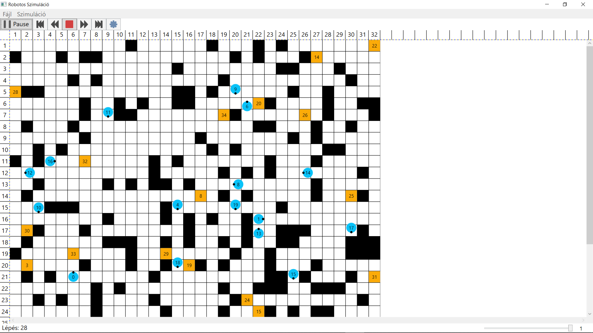

A program a Windows beépített fájlválasztóját használja:

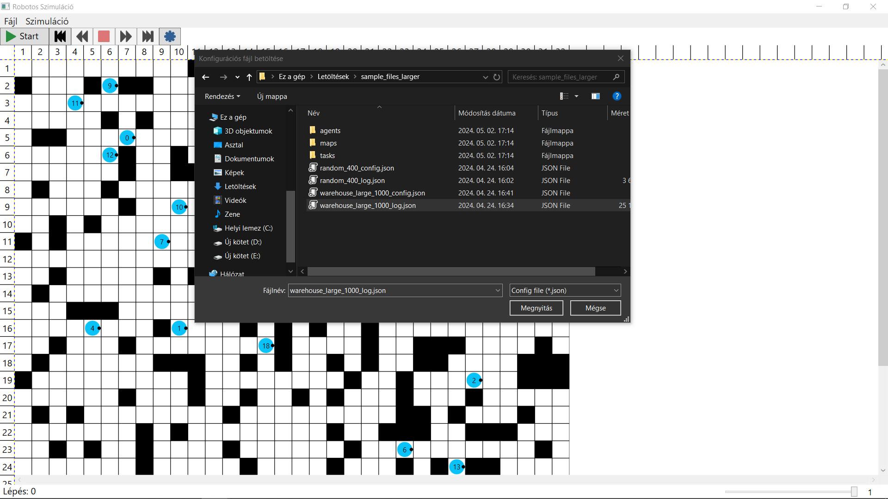Tetszőleges konfigurációs fájl tölthető be, a már betöltött konfigurációs fájlhoz visszajátszás tölthető be:

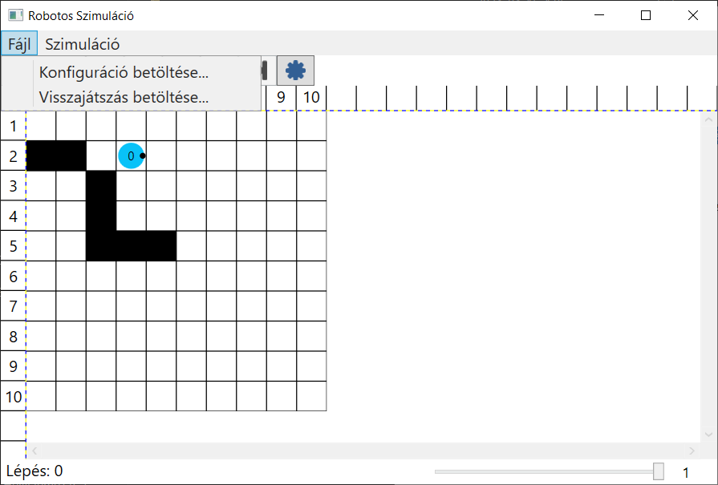

A már betöltött konfigurációs fájlból új szimuláció indítható, vagy a legutóbbi szimulációs futás elmenthető:

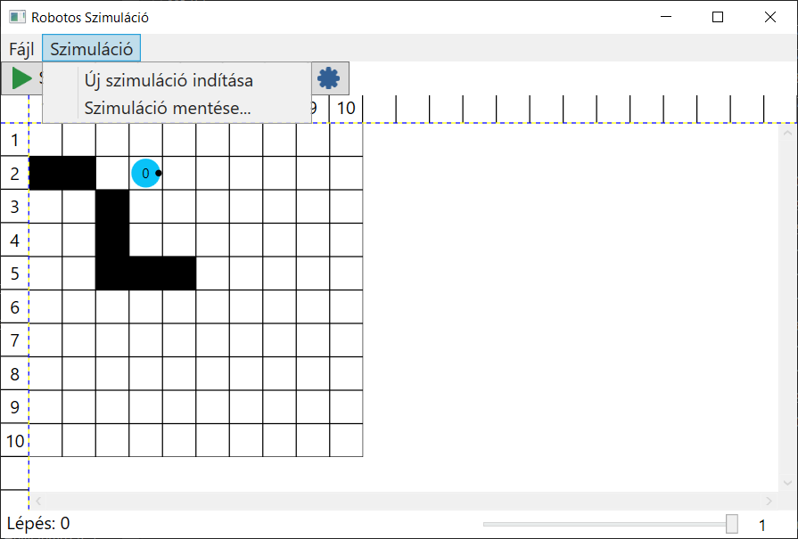

Szimuláció futtatása esetén beállítható meddig tartson egy futás, illetve a lépések időtartama:

Visszajátszásnál egy adott lépésre ugorhatunk, valamint állíthatjuk a visszajátszás sebességét:

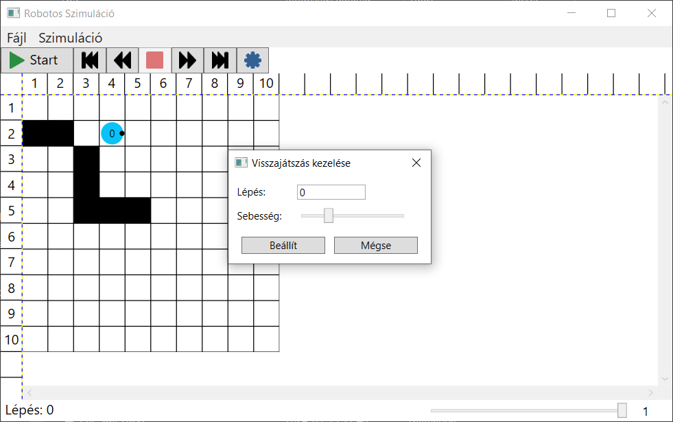

# Feladatleírás

[Feladatleírás.pdf](uploads/47a4e04c5bc58846dc3815d1f51b6f4a/Gyakorlatra_feladat.pdf)

# Fejlesztői dokumentáció

## Szimuláció

A `Simulation` osztály két fő állapota a szimuláció futtatása, visszajátszása. Ekkor megfelelően a mediátora egy `ISimulationMediator` vagy `IReplayMediator`.

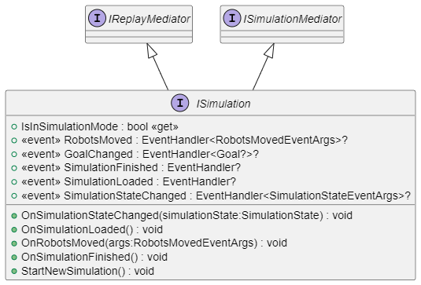

A függőségek konstruktoron keresztül kerülnek befecskendezésre. A függőségeket a `ServiceLocator` osztály tartalmazza.

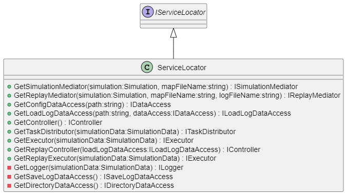

## Szimulációs lépés végrehajtása

Egy szimulációs lépés végrehajtásáért, logolásáért az `IExecutor` felel. Az egyes executorok különböző logika szerint kezelhetik a vezérlő által visszaadott, esetlegesen hibás utasításokat.

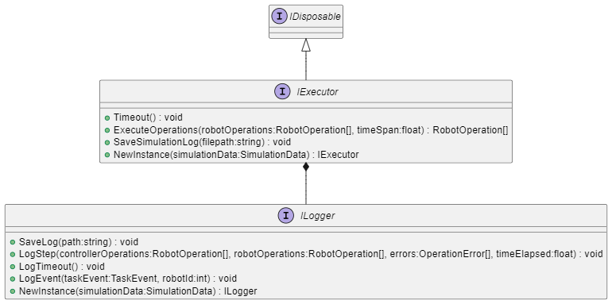

A mediátor minden szimulációs lépésben utasítást kér a vezérlőtől. Ha a vezérlő nem adott utasítást még vissza, akkor ez a kérés nem történik meg, hanem az `IExecutor` `Timeout()` metódusát hívja meg. Ekkor a végrehajtó elmenti, hogy időtúllépés történt.

Amikor a vezérlő utasítást küld vissza a mediátornak, az meghívja a végrehajtó `ExecuteOperations(...)` metódusát. Ekkor a végrehajtó megpróbálja végrehajtani az utasításokat. Ha ez nem sikerült, a robot `BlockedThisTurn` mezőjét igazra állítja. Elmenti a végrehajtott lépéseket, hibákat majd visszatér a végrehajtott lépésekkel.

## Mediátorok

A mediátorok valósítják meg a hozzájuk tartozó funkciók végrehajtását, kezelését. A `SimulationMediator` a valódi szimuláció futtatásáért és kezeléséért, míg a `ReplayMediator` a visszajátszás kezeléséért felel.

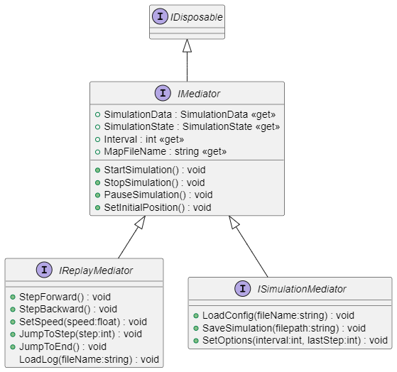

A mediátorok ősosztálya, a `MediatorBase` valósítja meg a belső állapotváltozásokat.

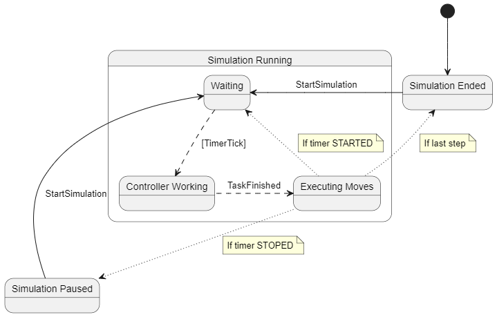

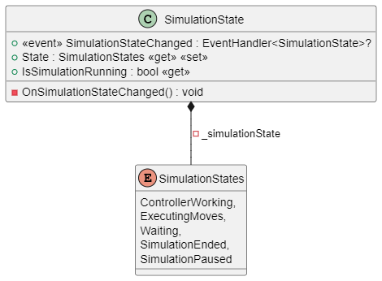

## Vezérlő

A vezérlő felel a robotok irányításáért.

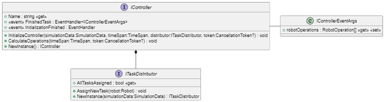

A mediátor hívja meg az első szimulációs lépésben a vezérlő `InitializeController(...)` metódusát. Itt kapja meg a feladatok kiosztására használandó `ITaskDistributor`-t, amivel bármikor új feladatot rendelhet a robotokhoz. Ha végzett az inicializálással, a `InitializationFinished` eseményt kiváltja.

Minden szimulációs lépésben a mediátor meghívja a vezérlő `CalculateOperations(...)` metódusát. Ha a vezérlő végzett a számításaival, a `FinishedTask` eseményt kiváltja, ami tartalmazza az utasításokat minden robotnak. Valamint elvárt, hogy ezt minden robot esetén be is állítsa a `NextOperation` adattagban.

# Megvalósíthatósági terv

## Humán erőforrások

3 fejlesztő (3 \* 100 óra)

1 scrum master (3 \* 30 óra)

1 termékgazda

## Hardver erőforrások

3 fejlesztői számítógép

fejlesztői környezet futtatásához és program teszteléséhez megfelelő hardver

## Szoftver erősorrás

### Fejlesztői és tesztelő környezet

Fejlesztői környezet: Visual Studio 2022

Verziókezelés: [GitLab](https://gitlab.com/)

### Tervezés

Diagrammokhoz: [StarUML](https://docs.staruml.io/user-guide/user-interface),[ diagrams.net](https://app.diagrams.net/)

Nézet terv :[ Figma](https://www.figma.com/)

### Kommunikáció

Kommunikációs csatornák: Discord, MSTeams

Feladatok kiosztása: GitLab Issues

## Üzemeltetés

nem kell biztosítani

## Karbantartás

felmerülő hibák javítása

## Összegzés

Összesített időtartam: 400 óra

Költség: nincs

# Funkcionális követelmények

## Program indításakor:  
- töltődjön be egy alap konfiguráció (32x32-es térkép, 10 robot, 10 feladattal)
## Szimuláció indítása előtt:  
- lehessen konfigurációt betölteni fájlból
- lehessen betölteni naplófájlt
- lehessen kilépni az alkalmazásból
- lehessen elindítani a jelenlegi konfiguráció, vagy a naplófájl alapján egy szimulációt
## Konfigurálás:  
- lehessen megadni raktárméretet (0 < szélesség <= 800,0 < hosszúság <= 800), 
- lehessen robotokat hozzáadni pozíció szerint (0 < robotok száma <= 2.000)
- lehessen célokat meghatározni a robotoknak
## Szimuláció közben:  
- lehessen ráközelíteni a térkép egyes részeire
- lehessen látni a térképen a lépéseket
## Szimuláció futtatása után:  
- lehessen új konfigurációt választani
- lehessen naplófájlba kimenteni a szimuláció eredményeit, lépéseit
## Naplófájl újrajátszásakor:  
- lehessen megállítani, elindítani a szimulációt
- lehessen gyorsítani, lassítani a szimulációt
- lehessen ugrani a szimuláció lépéseiben

# Nem funkcionális követelmények

## **Hatékonyság:** 
- A pálya méretétől, valamint a robotok számától függően nagy mértékben terheli a processzort
- Nincs szükség sok memóriára (legfeljebb 4gb) háttértárra, hálózatot nem igényel 
- Szimuláció újrajátszásakor gyors (1 másodperc) alatti válaszidő.  
## **Megbízhatóság:**  
- A szimuláció nem áll le váratlanul hibával.
- A program hibát csak akkor dob, ha valamilyen bemenet (algoritmus, log file) nem helyes, illetve ha az adott log file-t nem a megfelelő config file után szeretnénk megtekinteni     
## **Biztonsági, jogi:**  
- Amennyiben a program helytelenül működik, és a helyesnek vélt algoritmust egy tényleges raktárban is alkalmazzák, anyagi károk keletkezhetnek, valamint személyi sérülés is történhet
## **Hordozhatóság:**  
- Windows platformon használható (Windows 10) , szükséges hozzá C# .NET keretrendszer
- Egyéb telepítés nem szükséges  
## **Felhasználhatóság:**  
- Intuitív felhasználói felület: külön segédlet nem szükséges a használathoz  

# Use Case Diagram

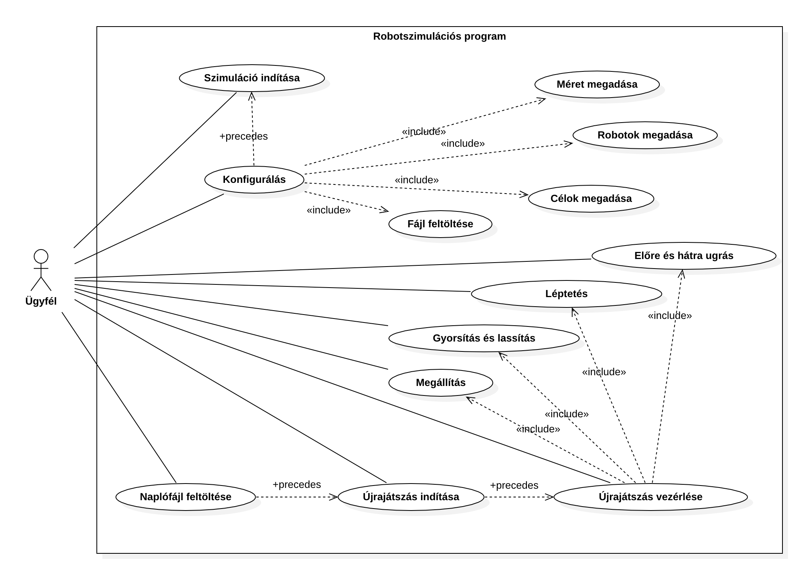

# Felhasználói történetek

Szimuláció futtatása

**AS A:** Felhasználó

**I WANT TO:** Futtatni a szimulációt

**SO THAT:** Lássam, hogy a robotok hogyan jutnak el a megadott feladatokhoz

|  |  |  |
|--|--|--|
| 1 | GIVEN | Szimuláció be van töltve |
|  | WHEN | Rákattintok az elindítás gombra |
|  | THEN | A szimuláció elindul |
| 2 | GIVEN | A szimuláció fut |
|  | WHEN | Rákattintok a Megállítás gombra |
|  | THEN | A szimuláció megáll és van lehetőségem elmenteni az eredményét |

Szimuláció kezelése

**AS A:** Felhasználó

**I WANT TO:** Kezelni a szimulációt

**SO THAT:** Részletesebben meg tudjam vizsgálni a szimuláció eredményét

|  |  |  |
|--|--|--|
| 1 | GIVEN | Szimuláció fut |
|  | WHEN | Rákattintok a szüneteltetés gombra |
|  | THEN | A szimuláció megáll |
| 2 | GIVEN | Szimuláció visszajátszása fájlból |
|  | WHEN | Rákattintok a sebesség változtató gombra |
|  | THEN | A szimuláció sebessége változik |
| 3 | GIVEN | Szimuláció visszajátszása fájlból |
|  | WHEN | Rákattintok a léptetés gombra |
|  | THEN | A szimuláció a megadott irányba lép |
| 4 | GIVEN | Szünetel a szimuláció |
|  | WHEN | Rákattintok a naplófájl mentés gombra |
|  | THEN | Az általam megadott helyre mentődik a naplófájl |

Konfiguráció beállítása

**AS A:** Felhasználó

**I WANT TO:** beállítani a konfigurációt

**SO THAT:** A szimulációt a saját adataimmal tudjam futtatni

|  |  |  |
|--|--|--|
| 1 | GIVEN | Szimuláció nem fut |
|  | WHEN | Rákattintok konfiguráció |
|  | THEN | Megjelenik egy konfigurációs ablak |
| 2 | GIVEN | Konfigurációs ablakon |
|  | WHEN | Rákattintok a betöltés gombra |
|  | THEN | A konfiguráció betölt és tudom változtatni az értékeit |
| 3 | GIVEN | Konfigurációs ablakon |
|  | WHEN | Rákattintok a mentés gombra |
|  | THEN | Az általam megadott helyre mentődik a konfigurációs fájl |
| 4 | GIVEN | Konfigurációs ablakon |
|  | WHEN | Rákattintok az elfogadás gombra |
|  | THEN | A szimuláció betölt a megadott konfiguráció alapján |

 
<h3> 